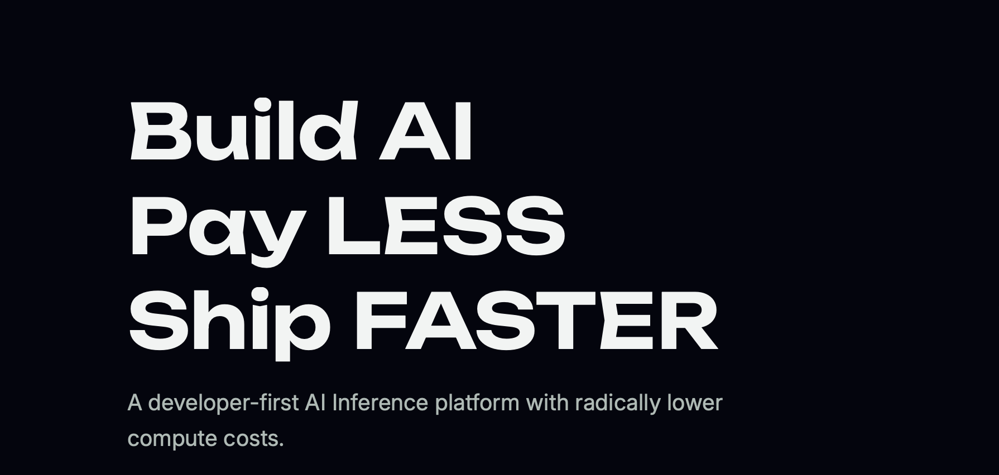

<div align="center">
  
  <br><br>
  
  <br><br>

  <p>
    <a href="#"></a>
    <a href="#"></a>
    <a href="#"></a>
  </p>
</div>

---

Welcome to **Oxtools**, the official open-source repository maintained by the **Cyborg Network** core team. 

This repository serves as a centralized, high-fidelity ecosystem for community-built prototypes, decentralized applications, and infrastructure tooling powered exclusively by the **Oxlo API**. Our objective is to curate a suite of secure, robust, and highly functional integrations submitted by our global network of developers, interns, and hackathon participants.

## 🏛️ Repository Architecture

To maintain modularity and high operational standards, Oxtools is structured as a monorepo. Every approved integration operates as an independent, isolated application housed within the `projects/` directory.

```text
Oxtools/
├── .github/                  # CI/CD and repository governance templates
├── assets/                   # Official branding and repository imagery
├── docs/                     # Ecosystem documentation and API references
├── projects/                 # The core directory for all approved integrations
│   ├── [project-name]/       # Isolated project environment
│   │   ├── src/
│   │   ├── .env.example      # Mandatory environment template
│   │   ├── README.md         # Mandatory project-specific documentation
│   │   └── package.json      # Dependency management
└── CONTRIBUTING.md           # Engineering standards and submission pipeline