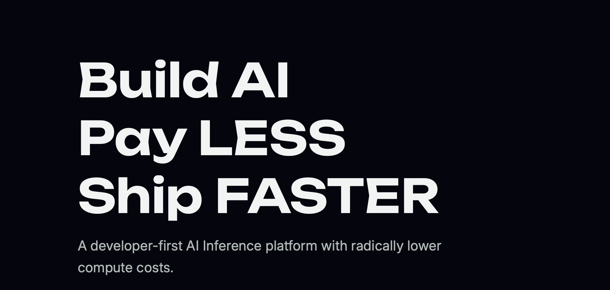

<div align="center">
  
  <br><br>
  
  <br><br>

  <p>
    <a href="https://oxlo.ai"></a>
    <a href="./CONTRIBUTING.md"></a>
    <a href="./LICENSE"></a>
  </p>
</div>

---

**Oxtools** is an open-source AI developer toolkit powered by the [Oxlo.ai](https://oxlo.ai) API. It ships a production-ready Next.js dashboard with **25 active AI tools** across 6 categories — from code debugging and architecture diagrams to deep multi-agent research.

Every tool runs against Oxlo's low-cost inference layer, giving developers access to **50+ LLMs** (DeepSeek, Qwen, Llama, Gemini, GPT, Claude, and more) through a single API key at a fraction of mainstream pricing.

## Features

- **25 Active Tools** — zero stubs, every tool works out of the box
- **Live Visual Previews** — HTML/CSS outputs render in an iframe, Mermaid diagrams render as interactive SVGs
- **Tiered Architecture** — lightweight LLM tools (Tier 1) and heavy Python services (Tier 2)
- **Free Tier** — 5 uses per tool per day, no API key required
- **Dark and Light Themes** — polished UI with Unbounded and Inter typography
- **Tool History** — persistent per-tool usage history via IndexedDB
- **Streaming** — real-time token streaming for all tools
- **Open Source Contributions** — add your own tools with a simple file-based convention

## Tool Categories

| Category | Tools | Description |
|---|---|---|
| Developer Tools | Code Error Debugger, Security Scanner, Unit Test Generator, PR Summarizer, CSS Explainer | Debug, analyze, and generate code |
| Data and API | SQL Converter, API Validator, API Change Analyzer, Mock API Generator, JSON to Schema, CSV Insights, Sample Dataset Generator | Work with APIs, SQL, and data schemas |
| Docs and Text | Regex Explainer, README Generator, Grammar Checker, Text Formatter, PDF Summarizer | Generate documentation and format text |
| Design and Visual | Architecture Diagram, UI to Code, Color Palette Generator, Screenshot to Code | Convert designs, generate visual code with live previews |
| DevOps and System | System Log Analyzer, Bug Reproduction Replayer | Analyze logs and reproduce bugs |
| Content and Marketing | Caption Generator, SEO Writer, Deep Research | Generate captions, SEO copy, and multi-agent research |

## Repository Layout

```
Oxtools/
├── app/                          # Next.js 16 dashboard (frontend)
│   ├── src/
│   │   ├── app/                  # Pages and API routes
│   │   ├── components/           # UI components (sidebar, result-viewer, etc.)
│   │   ├── hooks/                # Tool execution, history, usage hooks
│   │   ├── lib/tools/            # Tool definitions (Tier 1 and Tier 2)
│   │   └── types/                # TypeScript interfaces
│   └── package.json
├── services/
│   └── python-tools/             # Unified Python Tool Runner (Tier 2)
│       ├── runner.py             # Auto-discovers tools from tools/*/tool.py
│       ├── Dockerfile
│       └── tools/
│           ├── _template/        # Copy this to create a new Python tool
│           ├── screenshot-to-code/
│           └── deep-research/
├── docs/                         # Contributing guides
│   ├── adding-a-python-tool.md   # Guide: add a Tier 2 Python tool
│   └── adding-a-frontend-tool.md # Guide: add a Tier 1 frontend tool
├── docker-compose.yml            # Production multi-container setup
├── docker-compose.dev.yml        # Development setup
├── CONTRIBUTING.md               # Contribution guidelines
└── .env.example                  # Required environment variables
```

## Architecture

Oxtools uses a two-tier architecture:

```
User  ->  Next.js Dashboard (port 3001)
            |
            |-- Tier 1 (Frontend Tools)
            |     Direct LLM calls via Oxlo API
            |     (code-debugger, sql-converter, readme-generator, etc.)
            |
            |-- Tier 2 (Python Services)
                  Proxied to Python Runner (port 9080)
                  (screenshot-to-code, deep-research, etc.)
                  Auto-discovers tools/*/tool.py
```

**Tier 1** tools are pure prompt-engineered LLM calls defined entirely in TypeScript. They require no backend — the Next.js API route calls Oxlo directly.

**Tier 2** tools require custom Python logic (Playwright, LangGraph, computer vision, etc.) and run inside a unified Docker container that auto-discovers tool modules.

## Quick Start

### Prerequisites

- Node.js 18 or higher
- Docker and Docker Compose (for Tier 2 tools)
- An Oxlo API key from [portal.oxlo.ai](https://portal.oxlo.ai) (optional — free tier works without one)

### 1. Clone and install

```bash
git clone https://github.com/Cyborg-Network/Oxtools.git
cd Oxtools

# Install frontend dependencies
cd app && npm install
```

### 2. Configure environment

```bash
# Copy the example env file
cp .env.example .env

# Edit .env and add your Oxlo API key (optional for free tier)
```

### 3. Run the dashboard

```bash
# Start Next.js (Tier 1 tools work immediately)
cd app && npm run dev
# Available at http://localhost:3001
```

### 4. Start Tier 2 services (optional)

```bash
# From the repo root — starts the Python Tool Runner
docker compose -f docker-compose.dev.yml up --build
# Python runner available on port 9080
```

## Contributing

We welcome contributions. There are two ways to add tools:

| Path | When to use | Guide |
|---|---|---|
| Frontend Tool (Tier 1) | Pure LLM prompt tool — no custom backend needed | [docs/adding-a-frontend-tool.md](./docs/adding-a-frontend-tool.md) |
| Python Tool (Tier 2) | Needs custom logic, libraries, or multi-step agents | [docs/adding-a-python-tool.md](./docs/adding-a-python-tool.md) |

Read [CONTRIBUTING.md](./CONTRIBUTING.md) for the full process, requirements, and PR workflow.

## License

[Apache 2.0](./LICENSE)